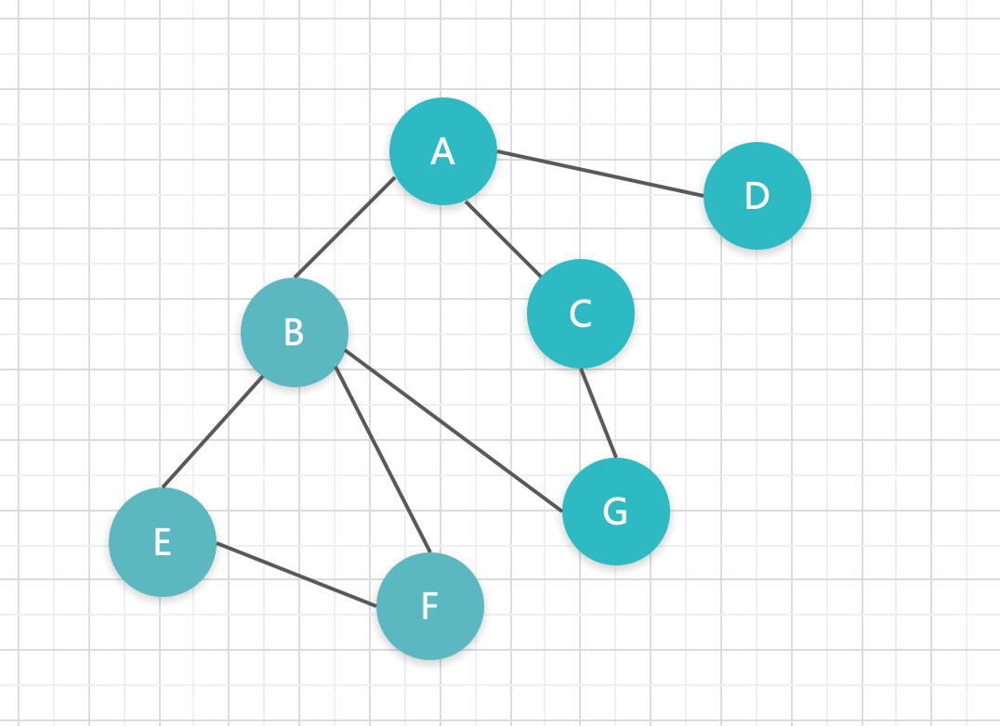
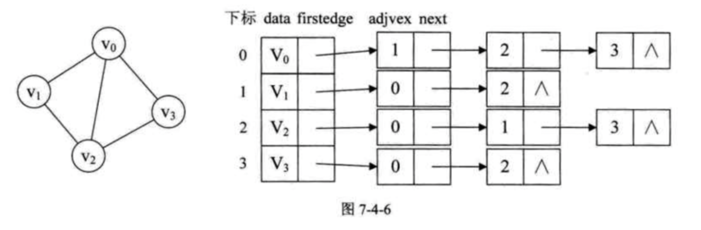

# 图的存储方式





## 邻接矩阵表示法 index.js

## 邻接表表示法 index1.js

邻接表需要注意的有两点：

一是已经存在的边我们不需要再输入 `(vi, vj)` 的顶点信息了；

二是使用头插法还是尾插法插入结点。对于本例中，我们是用头插法进行插入的：




比如上图这样的结构，它的存储顺序是按左到右的，即对于 v0，先存 v1，再存 v2，v3。

在输入 (vi, vj) 的顶点序号，我们需要从右往左输入：

```
i: 0 j: 3
i: 0 j: 2
i: 0 j: 1
```

这会影响到遍历的顺序：因为图的遍历是需要选一个策略的，是从左边还是右边开始遍历。